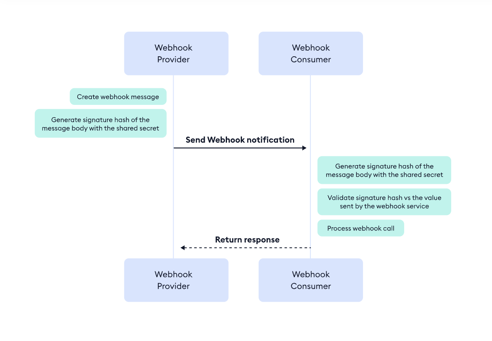

## Description

This is simple Webhook Server implementation to receive webhook payload and verify the signature using Hash-based Message Authentication Code (HMAC).
The server listen to `POST` requests at `/webhook` endpoint.

To check the `/webhook (POST)` implementation see `src/app.controller.ts`

To test the server with real webhook request you can use [ngrok](https://ngrok.com)
to expose localhost to public internet and use the ngrok url as external host.

The server utilize `node:crypto` library to create and verify HMAC signature.
The `sha256` algorithm is used.





To update signature secret use the `SECRET_TOKEN` in the `.env`.

```ts
import { createHmac, BinaryToTextEncoding } from 'node:crypto';

/**
 * Create Keyed-Hashing representation for text
 * HMAC stands for Keyed-Hashing for Message Authentication.
 * @param text
 * @param secret
 * @param encoding
 * @param algorithm
 * @param addAlgorithmPrefix
 * @returns
 */
export const hmac = (
  text: string,
  secret: string,
  encoding: BinaryToTextEncoding = 'hex',
  algorithm = 'sha256',
  addAlgorithmPrefix = true,
) => {
  if (!text) return text;
  const hash = createHmac(algorithm, secret).update(text).digest(encoding);

  return addAlgorithmPrefix ? `${algorithm}=${hash}` : hash;
};

```


## Installation

```bash
$ npm install
```

## Running the app

To update signature secret use the `SECRET_TOKEN` in the `.env`.

```bash
# development
$ npm run start

# watch mode
$ npm run start:dev

# production mode
$ npm run start:prod
```

## Setup public URL with ngrok

1. Install [ngrok](https://ngrok.com/download).

2. Start the application
```bash
$ npm run start
```

3. Expose your application from localhost to public internet
```bash
$ ngrok http 3000

Version                       3.1.1
Region                        United States (us)
Latency                       -
Web Interface                 http://127.0.0.1:4040
Forwarding                    https://09f5-2601-640-8000-d4a0-bd9d-56bf-9af3-790f.ngrok-free.app -> http://localhost:3000
```
where `3000` is you application port.

4. Use the generated endpoint `https://09f5-2601-640-8000-d4a0-bd9d-56bf-9af3-790f.ngrok-free.app` +  `/webhook` to create/update webhook Endpoint URL.


## Test

```bash
# unit tests
$ npm run test

# e2e tests
$ npm run test:e2e

# test coverage
$ npm run test:cov
```

## License

Nest is [MIT licensed](LICENSE).
